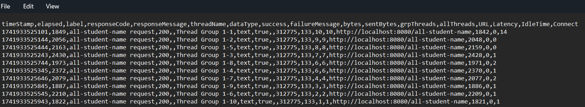

# Modul 5
Sebelum profiling  

Sesudah profiling  

### Konklusi
Terdapat peningkatan performa setelah dilakukan profiling dan optimasi performa. Endpoint `/all-student` yang awalnya 
berjalan lebih dari 1 menit menjadi 2-3 detik. Endpoint `/all-student-name` yang awalnya berjalan 1-2 detik menjadi 70-115 ms. 
Endpoint `/highest-gpa` yang awalnya berjalan 70-100 ms menjadi 5-40 ms saja. Jadi, dengan melakukan profiling dan optimasi
performa, kita bisa menjalankan kode dengan lebih cepat dan efisien.

## Refleksi
1. Perbedaan melakukan performance testing di JMeter dan profiling di Intellij Profiler terletak pada hasil yang ditampilkan. 
Pada JMeter, kita hanya bisa melihat waktu yang dibutuhkan untuk kode berjalan. Sedangkan pada Intellij Profiler, kita juga bisa 
melihat secara detail waktu yang dibutuhkan masing-masing method dan method mana yang membutuhkan paling banyak waktu.

2. Ketika melakukan profiling, Intellij Pofiler akan memberi highlight pada method yang paling lama runtime nya sehingga 
saya bisa langsung melakukan optimasi method yang dihighlight tanpa harus mengecek keseluruhan kode terlebih dahulu. Hal ini
juga mempercepat proses optimasi.

3. Intellij Profiler sangat membantu dalam proses analisis karena Profiler langsung menunjukkan running time masing-masing method
dan juga memberi highlight pada bagian dengan runtime paling lama sehingga saya tidak perlu menganalisis keseluruhan kode untuk melakukan
optimasi.

4. Tantangan yang saya hadapi yaitu melakukan optimasi terhadap method yang menjadi bottleneck. Untuk mengatasinya bisa dengan
lebih memahami cara kerja program atau mencari referensi-referensi yang bisa membantu proses optimasi.

5. Keuntungan menggunakan Intellij Profiler adalah kita tidak perlu membuka aplikasi lain karena sudah terintegrasi dengan 
intellij secara langsung. Kita juga tidak perlu melakukan set up untuk melakukan profiling dan performance testing.

6. Jika hasil dari JMeter dan Intellij Profiler tidak konsisten, bisa dilakukan pengetesan secara berulang-ulang untuk mengecek konsistensi.
Jika masih terdapat inkonsistensi, bisa saja terdapat perbedaan konfigurasi set up program atau perbedaan lain yang tidak bisa diatasi
secara langsung.

7. Agar bisa melakukan optimasi tanpa mengubah fungsionalitas program, kita harus memahami dulu alur program secara keseluruhan.
Lalu kita bisa melakukan optimasi dengan mengubah beberapa implementasi dari method seperti tipe data atau struktur data yang digunakan. 
Kita juga bisa membandingkan program sebelum dan sudah melakukan optimasi untuk mengecek apakah fungsionalitas tidak berubah sesudah optimasi.